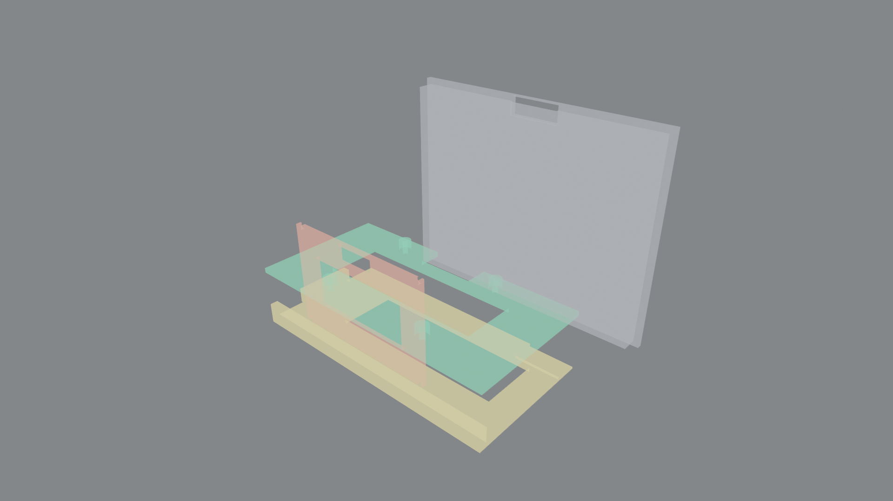

# 🤖 Desktop Buddy Robot (Raspberry Pi 3)

> Nota de estado atual (2026-04-27): o README abaixo ficou como contexto historico.
> A fonte principal do projeto atual e [AGENTS.md](AGENTS.md), e o redesign em caixa desta sessao esta em [redesign](redesign).
> A imagem [montagem.png](montagem.png) agora reflete esse redesign novo.

Projeto de um robô de mesa minimalista em formato de “cabeça”, projetado para acomodar um Raspberry Pi 3 Model B, uma tela frontal e um powerbank removível, com foco em simplicidade, modularidade e facilidade de montagem.

---

# 🎯 Propósito do Projeto

Este projeto tem como objetivo criar um **robô de mesa funcional e personalizável**, que pode ser utilizado como:

* Assistente local (LLM, automação, dashboards)
* Interface visual com tela frontal
* Dispositivo IoT ou monitoramento
* Objeto decorativo interativo

O design prioriza:

* 🧱 Estrutura simples (fácil de imprimir)
* 🔧 Montagem intuitiva
* 🔋 Manutenção rápida (bateria removível)
* 🧠 Compatibilidade com Raspberry Pi 3 Model B
* 🖥️ Integração com display frontal
* 🧵 Organização interna de cabos

---

# ⚙️ Premissas Técnicas

## 📏 Unidades e Modelagem

* Todas as dimensões são em **milímetros (mm)**
* Escala real **1:1**
* Modelagem feita no **Blender**
* Exportação em **STL**

## 🖨️ Impressão 3D

* Impressora alvo: **Creality Ender 3 V3 SE**
* Material recomendado: **PLA**
* Espessura de parede: **2 a 3 mm**
* Tolerâncias:

  * encaixes: **0.3 a 0.5 mm**
  * partes móveis: **0.5 a 1 mm**

---

# 📦 Componentes Utilizados

## 🧠 Raspberry Pi 3 Model B

* Dimensões: **85 x 56 mm**
* Furos:

  * 58 mm (horizontal)
  * 49 mm (vertical)
  * diâmetro: ~2.7 mm (M2.5)

## 🖥️ Tela

* Tipo: **2.42" OLED I2C** (modelo: 2.420LED-IIC VER:1.1)
* Driver: **SSD1309**
* Resolução: **128 × 64 pixels**
* PCB (módulo): **61.5 × 39.5 mm**
* Área visível do display: **55.01 × 27.49 mm**
* Tamanho do pixel: 0.4 × 0.4 mm
* Interface: **I2C** (4 pinos: VCC, GND, SDA, SCL)
* Tensão: 3.3V / 5V
* Possui:

  * PCB maior que área visível
  * 4 furos de fixação nos cantos (~M2.5)

## 🔋 Powerbank

* Tipo: USB padrão
* Dimensões variáveis (medir manualmente)
* Deve ser **removível facilmente**

---

# 🧱 Arquitetura do Robô

O design segue uma estrutura em camadas:

```
[ FRENTE ]
  → Tela

[ MEIO ]
  → Raspberry Pi

[ FUNDO / BASE ]
  → Powerbank (removível)
```

Benefícios:

* Organização interna
* Melhor ventilação
* Facilidade de montagem
* Acesso rápido à bateria

---

# 🧩 Peças do Projeto

O modelo é dividido nas seguintes partes:

1. Casca externa (estrutura principal)
2. Chassi interno
3. Suporte do Raspberry Pi
4. Suporte da tela
5. Berço do powerbank
6. Tampa traseira
7. Guias de cabos
8. Peça de teste de tolerância

---

# 📁 Estrutura de Saída

Cada peça deve ser exportada como:

```
/stl/
  ├── 01_shell.stl
  ├── 02_internal_chassis.stl
  ├── 03_raspberry_mount.stl
  ├── 04_screen_mount.stl
  ├── 05_powerbank_holder.stl
  ├── 06_back_cover.stl
  ├── 07_cable_guides.stl
  ├── 08_tolerance_test.stl
```

---

# 🧠 Workflow de Desenvolvimento

1. Criar peça no Blender
2. Validar dimensões (painel N)
3. Exportar STL
4. Abrir no slicer (Cura / Prusa)
5. Validar escala
6. Imprimir peça de teste
7. Ajustar tolerâncias
8. Imprimir versão final

---

# ⚠️ Boas Práticas

* Sempre modelar com folga (não justo)
* Nunca confiar “no olho”
* Validar encaixes antes de imprimir tudo
* Priorizar acesso fácil à manutenção
* Planejar cabos desde o início

---

# Imagem da montagem


---

# 🚀 PROMPTS DE MODELAGEM (ORDEM DE EXECUÇÃO)

## 🔹 0. Prompt Base (usar antes de todos)

```text
Crie uma peça técnica para impressão 3D e também uma imagem ortográfica/industrial do mesmo objeto. 
Use unidades em milímetros, escala real 1:1, precisão mecânica, tolerâncias de impressão 3D e aparência limpa de CAD.
A peça faz parte de um robô de mesa em formato de cabeça quadrada, simples e modular, fácil de montar e desmontar.
Priorize:
- encaixes simples
- manutenção fácil
- passagem organizada de cabos
- fixação segura dos componentes
- paredes com 2 a 3 mm de espessura
- folgas funcionais de 0,3 a 0,5 mm para encaixes impressos em 3D
Não invente proporções artísticas. Respeite medidas reais.
```

---

## 🔹 1. Casca externa

```text
Crie a casca externa de uma cabeça quadrada para robô de mesa, com design minimalista e funcional.

Dimensões externas alvo:
- largura: 120 mm
- altura: 100 mm
- profundidade: 80 mm

Abertura frontal para tela 2.42" OLED:
- abertura: 57 x 29.5 mm (área visível 55x27.5mm + 1mm margem)
- centralizada na frente, a 50mm de altura

Requisitos:
- frente com abertura central para a tela 2.42" OLED
- moldura frontal com espessura visível de 3 a 5 mm
- cantos levemente arredondados (bevel 5mm, 4 segmentos)
- traseira com tampa removível (abertura 110x90mm)
- base estável para ficar sobre mesa
- espaço interno suficiente para Raspberry Pi 3, tela e powerbank
- ventilação discreta nas laterais (5 slots por lado, 2x25mm)
- 4 postes internos de fixação (raio 3mm, altura 5mm)
- manter aparência de “buddy robot”, sem detalhes excessivos

Importante:
- gerar a peça como corpo oco
- prever espessura de parede de 2 a 3 mm
- prever pontos de fixação internos para as demais peças
- não incluir eletrônica modelada, só a estrutura externa
```

---

## 🔹 2. Chassi interno

```text
Crie o chassi interno principal para um robô de mesa em formato de cabeça quadrada.

Função da peça:
- sustentar a tela na frente
- sustentar o Raspberry Pi 3 no meio
- sustentar um powerbank removível na parte traseira ou inferior
- organizar o volume interno em camadas

Requisitos:
- estrutura interna modular
- canais para cabos com pelo menos 5 mm de largura útil
- folga mínima de 1 mm entre componentes e paredes
- divisões internas para separar área da tela, área da placa e área da bateria
- permitir montagem por etapas
- deixar acesso fácil às portas laterais/traseiras do Raspberry
- incluir pontos de apoio para a tampa traseira

Formato:
- peça única ou conjunto simples de suportes interligados
- geometria sólida, sem partes frágeis
- compatível com impressão 3D sem suportes complexos
```

---

## 🔹 3. Suporte Raspberry Pi

```text
Crie um suporte interno específico para Raspberry Pi 3 Model B, em peça separada, com fixação por parafusos.

Medidas obrigatórias da placa:
- placa: 85 mm x 56 mm
- padrão de fixação: 58 mm x 49 mm entre centros dos furos
- cantos da placa com raio aproximado de 3,0 mm
- usar furos de fixação com folga para parafuso M2.5, com diâmetro de passagem em torno de 2,7 mm

Requisitos do suporte:
- 4 standoffs alinhados com os furos oficiais do Raspberry Pi 3 Model B
- altura dos standoffs: 6 mm
- base reforçada para não dobrar
- manter a placa suspensa para passagem de cabos
- deixar as portas USB, Ethernet, HDMI e alimentação acessíveis por uma lateral ou traseira
- tolerância de montagem de 0,3 a 0,5 mm
- bordas arredondadas para facilitar impressão e montagem

Entregue a peça em escala real, pronta para encaixar no interior do robô.
```

---

## 🔹 4. Suporte da tela

```text
Crie a moldura frontal interna e o suporte da tela do robô de mesa.

Tela: 2.42" OLED I2C (SSD1309, 128x64px)
- largura da PCB: 61.5 mm
- altura da PCB: 39.5 mm
- área visível: 55.01 mm x 27.49 mm
- interface: I2C (4 pinos: VCC, GND, SDA, SCL)
- padrão de furos: ~57.5 mm x 35.5 mm (centro a centro)
- diâmetro dos furos: 2.7 mm (M2.5)

Requisitos:
- criar uma janela frontal alinhada exatamente com a área visível
- deixar a PCB da tela escondida atrás da frente
- prever pelo menos 10 mm de espaço atrás da tela para cabo e eletrônica
- incluir 4 pontos de fixação ou um encaixe por pressão controlado
- borda de apoio interna para a tela não cair para a frente
- tolerância de 0,3 a 0,5 mm nos encaixes
- moldura frontal simples, limpa e fácil de imprimir

A peça deve servir tanto como suporte técnico quanto como moldura estética frontal.
```

---

## 🔹 5. Berço do powerbank

```text
Crie um berço removível para prender um powerbank dentro de uma cabeça quadrada de robô de mesa.

Medidas reais do powerbank:
- largura: [LARGURA_POWERBANK] mm
- altura: [ALTURA_POWERBANK] mm
- profundidade: [PROFUNDIDADE_POWERBANK] mm

Requisitos:
- a peça deve permitir remover o powerbank com facilidade, sem desmontar o robô inteiro
- usar encaixe por trilho, berço lateral ou trava simples por pressão
- não usar parafusos no powerbank, para permitir retirada rápida
- deixar folga de 0,5 a 1,0 mm para inserção manual
- prever passagem para cabo de energia sem esmagar o conector
- garantir que o powerbank fique firme durante o uso
- base com apoio plano e lateral com retenção suave
- evitar cantos muito fechados

A peça deve ser simples, robusta e pensada para acesso frequente.
```

---

## 🔹 6. Tampa traseira

```text
Crie a tampa traseira de manutenção para um robô de mesa em formato de cabeça quadrada.

Requisitos:
- abertura fácil para acessar o powerbank, Raspberry Pi e cabos
- fixação simples por snap-fit ou por parafusos M3
- remoção manual sem ferramentas complexas
- encaixe alinhado com a casca externa
- borda de apoio com tolerância de 0,3 a 0,5 mm
- incluir travas ou linguetas suficientes para não abrir sozinha
- manter aparência limpa por fora
- prever ventilação, se necessário, sem comprometer a rigidez

A peça deve ser funcional, discreta e fácil de imprimir.
```

---

## 🔹 7. Guias de cabos

```text
Crie um conjunto de guias internos para cabos dentro de um robô de mesa com Raspberry Pi 3, tela frontal e powerbank removível.

Requisitos:
- canais com largura útil mínima de 5 mm
- curvas suaves, sem dobras apertadas
- separação entre cabos de energia e cabos de sinal quando possível
- clipes ou presilhas opcionais para prender fios
- manter 10 mm de folga atrás da tela
- não bloquear ventilação nem acesso às portas do Raspberry
- guias simples, integradas ao chassi, fáceis de imprimir

A peça deve organizar os fios sem aumentar demais o volume interno.
```

---

## 🔹 8. Peça de teste

```text
Crie uma peça de teste pequena para validar tolerâncias de encaixe antes do modelo final.

Requisitos:
- testar folgas de 0,2 mm, 0,3 mm, 0,4 mm e 0,5 mm
- incluir pequenos encaixes tipo trava, canal e pino
- usar espessura de parede igual à peça final
- servir para validar a impressora e o material
- geometria simples, compacta e rápida de imprimir

A peça deve ajudar a confirmar o ajuste dos encaixes antes de produzir o robô completo.
```

---

# 🧠 Considerações Finais

Este projeto foi pensado para ser:

* Modular
* Iterativo
* Customizável

Não existe uma única versão final — a ideia é evoluir o design conforme testes reais.

---

# � Histórico de Alterações

## v2 — Correção da tela (2.42" OLED I2C)

As peças originais foram modeladas com dimensões de um display 3.5" SPI (PCB 86×56mm).
Após testes de impressão, identificou-se que a tela real é um **2.42" OLED I2C** (PCB 61.5×39.5mm).

Peças reconstruídas:
- **01_shell**: abertura frontal reduzida de 70×50mm para **57×29.5mm**
- **02_internal_chassis**: zona da tela reduzida de 15mm para **12mm** de profundidade
- **04_screen_mount**: totalmente recriado para PCB 61.5×39.5mm, janela 56×28.5mm, furos M2.5, slot para cabo I2C, orientação flat para impressão sem suportes

Dimensões confirmadas via datasheet Waveshare 2.42" OLED Module (SSD1309):
- Módulo: 61.5 × 39.5 mm
- Área visível: 55.01 × 27.49 mm
- Pixel: 0.4 × 0.4 mm
- Resolução: 128 × 64

---

# 💡 Próximos Passos

* Integrar áudio (speaker + mic)
* Criar versão com ventilação ativa
* Evoluir design externo (personalidade do robô)

---

# 👾 Filosofia do Projeto

> Primeiro funcional. Depois bonito. Sempre simples.

---

Boa sorte com o build 🚀
